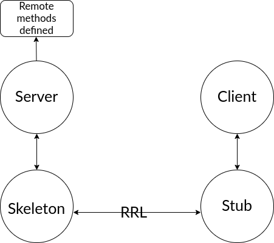

# Assignment 2 (Remote Method Invocation)

### How to run : 
* Make sure java is installed.
* Run following commands on one terminal: 
    ```
    javac *.java
    java Server <port-number>
    ```
* The server will now wait for clients to make calls.
* On another terminal window / client, execute 
    ```
    javac Client.java
    java Client <server-ip> <port-number>
    ```
* A command line interface is provided on the Client side, after the `java Client` command is run.

---

### Commands available :

Command  | Explanation
------------- | -------------
add_graph \<graph-id\> \<no_of_nodes\> | Adds graph with number of vertices = `no_of_nodes` to list of graphs on the server side, with graph id = `graph_id`.
add_edge \<graph-id\> \<u\> \<v\> \<w\>  | Adds edge from `u` to `v` with weight `w` to graph with graph id = `graph-id`.
get_mst \<graph_id\> | Computes the sum of weights of minimum spanning tree of the graph id passed. If no MST exists, `-1` is printed.

* An example is given in the `input` file.

---

### Files : 
```
.
├── Client.java
├── Edge.java
├── Grapher.java
├── GrapherMethods.java
├── MST.java
├── README.[md|pdf]
├── Server.java

```

---

### Architecture
* The Remote Method Invocation (RMI) protocol has been used for this assignment.
* A skeleton on the server side handles the remote methods invoked.
* On the server side, we have 4 functions, as defined in `Grapher.java`, namely : 
    * `add_graph`
    * `add_edge`
    * `get_mst`
    * `print_graph`
* The function names match the corresponding command required to execute them, as stated above.
* The Remote Reference Layer is the layer which manages the references made by the client to the remote object.
* The `stub` on the Client side is used to remotely invoke methods on the server side.
* In order for the Client files to work anywhere, the following files are needed by the client : 
    ```
    Client.java
    Grapher.java
    ```
    i.e, the interface which defines the methods on the server side need to be provided to the client as well.
* Attached below is a diagram :


---

### Algorithm Implementation
* Kruskal's algorithm has been used to find the total weight of the minimum spanning tree.
* All the functionality of the Kruskal's algorithm has been defined in `MST.java`.

---

### Results and observations
* The Remote Method Invocation protocol can be used to make a robust software that runs on one PC, or load balanced across multiple PCs, and can be used to serve clients which need to make use of the aforementioned software.
